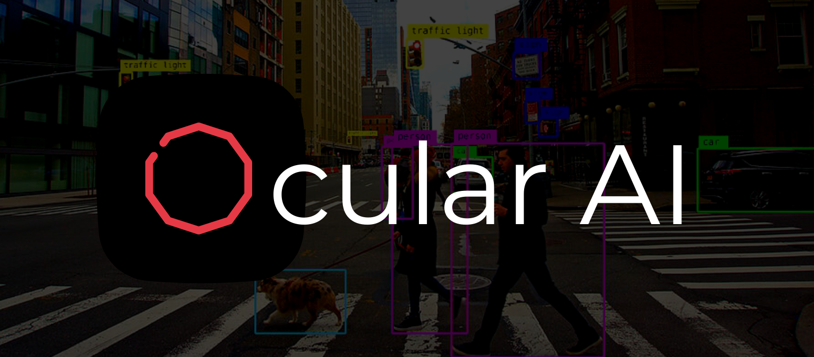
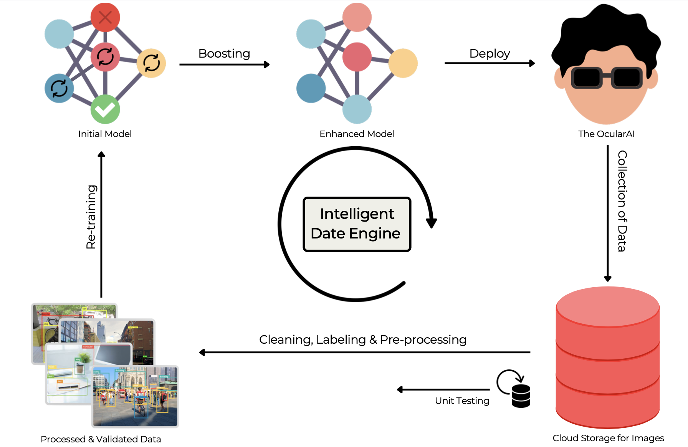

<h3 align="center"> 
<i>Redefining the "Sense of Sight"</i> 
</h3>

---

OcularAI is an intelligent wearable device invention intended to assist the blind. In everyday life, the Unsighted, also known as the Blind, encounter a series of difficult obstacles. Walking across the street, preparing a meal, and furthering their education all become laborious endeavours. Not to mention the plethora of accidents involving the unsighted population as a whole.

## What does **OcularAI** do ?

One primary goal of our proposed system is to identify objects and provide the user with audible feedback. 
If a wise man heard this, he might question our system by suggesting that we're using nothing more than a basic object detection model. I disagree that OcularAI stops at *object detection*. 

In particular, the device includes features and capabilities like **Currency Identification**, **Facial Recgonition**, and **Speech Recognition**.

> Each will, of course, be covered in greater depth in the following sections.

Still, our method has been called into question, and I must say that I strongly disagree. 

OcularAI's **Intelligent Data Engine** is one of the features that sets it apart from competing systems. Our Intelligent Data Engine was inspired by **Tesla**'s use of a similar structure.

## The Intelligent Data Engine

Conventionally, most AI solutions are developed, deployed once, and then completely overlooked. But our system uses the erroneous data that has been reported and the real-time data that has been collected to enhance the underlying network. More specifically, the algorithm relies on a feedback loop, during which it continuously gathers new data from the real-time and retrains its underlying structure. 

For this reason, we anticipate that our infused neural network will gradually get better over time through a process of iterative improvement.

**Facial Identification** In particular, we leverage ensmeble learning, to amalgamate two *state-of-the-art* facial recognition models, namely `FaceNet` and `VGG-Face`. Utilising this, the individual can swiftly recognize their peers and loved onces in real-time.

**Currency Recognition** In our everyday lives, we exchange cash with one another frequently. People who are visually impaired are especially vulnerable to deception because of their inability to distinguish between common pieces. Our method allows the user to effectively categorise denominations.

  

   

> *The project is still in the early stages of development, so my team and I are being deliberately vague about details. But very soon everything will be open to the public.*

